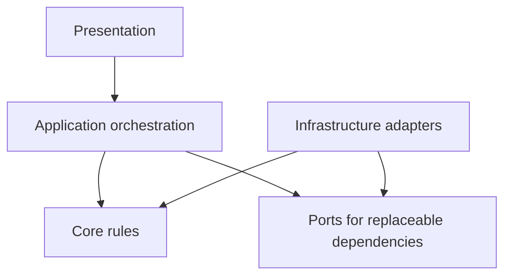

# Focus Beat Architecture

## Project overview

Focus Beat currently provides focus and break cycles, fixed and custom presets, timer controls, an alarm, local task text, daily session history, and optional Gregorian/contemplative, classical, or lo-fi music. English and Portuguese content are available.

The application is a small Next.js **modular monolith**: it is delivered as one application, and its responsibilities can become clearer internal modules without being split into services. The current free application is local-first. Next.js is configured for static export, the browser's `localStorage` stores user configuration and local activity data, and music playback uses the YouTube IFrame API after user consent.

## Current architecture

The following describes the repository after the core-boundary refactor.

- **React presentation:** App Router pages compose the home and About experiences. Components render the timer, controls, preset selector, task input, session-history sidebar, settings, music card, dialogs, and shared UI primitives.
- **React contexts:** `TimerContext` exposes timer and task/history state and commands; `ConfigContext` owns alarm/music preferences and playlist selection; `LanguageContext` owns language selection and translation lookup. The providers are composed around the home page. Other page templates compose the providers they require.
- **Timer orchestration and rules:** `TimerContext` owns React state, deadline/interval orchestration, alarm triggering, and completed-session recording. Pure types, presets, deadline calculations, phase transitions, restart, and abandon rules live in `core/timer`.
- **Local persistence:** synchronous configuration and timer-storage contracts have focused `localStorage` adapters. Providers accept optional implementations for tests. Language and media consent remain small browser concerns at their respective UI boundaries.
- **Music catalog and playback:** `core/music` defines product options and official sources. `MusicMiniCard` resolves a source and coordinates consent and timer autoplay, while `YouTubePlayer` receives explicit playlist, volume, and playback props and owns only YouTube infrastructure behavior.
- **Translations:** English and Portuguese message dictionaries live in `i18n`; `LanguageContext` owns only language hydration, persistence, document language, and lookup.
- **Tests:** Vitest runs in jsdom with React Testing Library. Context suites cover orchestration while focused suites cover pure timer rules, catalogs, translation parity, and concrete storage adapters.
- **External browser APIs:** the current code directly uses timers, `Date`, `HTMLAudioElement`, `window`, `document`, `localStorage`, dynamic script loading, and the global YouTube API. These dependencies are appropriate browser capabilities, but several are close to orchestration or presentation code.

This structure was reasonable for the application's original scope. As capabilities accumulated, a few modules began coordinating multiple responsibilities. The direction below improves those seams incrementally rather than replacing the working architecture wholesale.

## Remaining coupling points

### Timer context

`TimerContext` intentionally remains the React orchestrator for timer, task/history UI state, alarm, browser timing, and phase completion. Deterministic rules and storage validation no longer live there.

### Configuration context

`ConfigContext` coordinates configuration state with a synchronous repository. Catalog IDs and persisted-value validation are separate.

### Music playback

Several distinct concepts currently meet in the music components and configuration context:

- product choices (Gregorian/contemplative, classical, lo-fi, or no active playlist);
- music-source metadata (YouTube playlist IDs);
- playback operations and timer-driven autoplay;
- YouTube-specific script, global API, player, and consent behavior;
- React presentation and accessibility controls.

These concepts should become separate gradually. Catalog data can be separated from the YouTube adapter without inventing a general provider system; presentation can depend on a small playback boundary only if replaceability or testing justifies it.

### Language context

`LanguageContext` currently owns language selection and persistence, the complete English and Portuguese translation content, translation lookup, and the document's `lang` update. Translation messages may later move to dedicated files while the provider remains a small UI/application-state coordinator.

## Target architectural direction

This is a direction for dependency flow, not a mandatory folder tree or a requirement that every area become a separate layer immediately.

The arrows mean “may depend on.” Application orchestration uses core rules and contracts; concrete infrastructure fulfills relevant contracts and can use shared domain types.

### Presentation

Presentation includes React components, dialogs, pages, contexts, hooks, and UI-specific state. It renders user-visible behavior and translates browser/user events into application commands. Contexts may remain useful composition and orchestration tools; they should not become a home for every stable business rule.

### Application orchestration

Application code coordinates use cases and connects timer rules, persistence, and external services. It decides when work happens. Browser-specific implementation details should move out when that separation improves testing, clarity, or replaceability—not simply to satisfy a diagram.

### Core rules

Core rules include timer types, preset rules, focus/break transitions, long-break selection, remaining-time calculations, and restart or abandon-cycle behavior. Deterministic rules should preferably be types and pure functions so they can be understood and tested without rendering React.

### Ports

Ports are small contracts only for dependencies with realistic alternative implementations. Candidates include a clock, settings persistence, session-history persistence, and music playback. They are **candidates**, not a checklist: each interface should be introduced in the pull request that demonstrates its need.

The local implementation must not be made artificially asynchronous just because a possible future cloud adapter could be asynchronous. Callers can adopt asynchronous workflows later where they are genuinely required.

### Infrastructure adapters

Potential concrete adapters include a browser clock, `localStorage` settings storage, `localStorage` session-history storage, and a YouTube music player. Future cloud adapters are optional possibilities and are not part of the current application or this architecture implementation.

## Dependency direction

- Core rules must not import React.
- Core rules must not access `window` or `localStorage`.
- Core rules must not know about YouTube.
- Infrastructure may depend on core types or application contracts.
- Presentation may consume application services and domain types.
- External-service details must not leak into timer rules.
- React components and contexts coordinate UI and application state, while stable business rules move outside React gradually.
- Browser APIs and external services should be isolated where doing so improves testing or replaceability.

## Abstraction policy

An interface is justified when:

- an external dependency needs isolation;
- tests benefit from replacing an implementation;
- multiple implementations already exist or are likely soon; or
- calling code should not know technical details.

An interface is not justified when:

- the behavior is a trivial pure function;
- it only renames an existing function;
- it exists only because a future paid version might need something;
- it creates more files without reducing coupling; or
- it forces synchronous local behavior into an unnecessary asynchronous API.

Prefer practical decoupling over layers or patterns for their own sake. Prefer composition over inheritance. Abstract classes should be rare and used only if genuine shared, stateful behavior makes inheritance clearer than composition. Do not create `FreeTimer`, `AdvancedTimer`, `ProTimer`, or another product-edition inheritance hierarchy. Commercial plans do not belong in the timer domain.

The project should not add a dependency-injection framework, service locator, state-management library, ORM, backend, or monorepo without a concrete need. The result must remain understandable to a developer opening the repository for the first time.

## Free, Advanced, and future paid boundaries

### Free Simple

Free Simple is a simplified user experience using the same timer engine and local infrastructure.

### Free Advanced

Free Advanced is a more configurable user experience using the same timer engine and local-first infrastructure.

### Future paid product

A paid product does not currently exist. It may eventually introduce cloud persistence, synchronization, reports, custom integrations, or paid-only application services. No specific paid contracts, service topology, or storage design should be defined now. When concrete requirements exist, cloud or paid behavior should be added through concrete adapters and composition.

Simple and Advanced are UI/configuration modes within the same application. They are not separate repositories, permanent Git branches, separate timer implementations, or timer subclasses. If a paid application is later created, it should preferably reuse a shared core through composition rather than encode commercial plans into timer rules.

## Repository and branching strategy

- `master` should remain deployable.
- Use short-lived branches and keep one main responsibility per pull request.
- Prefer small, reviewable refactors that preserve observable behavior.
- Do not maintain permanent `free`, `advanced`, or `pro` branches.
- If a private paid application eventually exists, prefer an independent repository or application composition over a permanent divergent branch. Do not create that repository now.

Example branch names:

- `docs/architecture-foundation`
- `refactor/extract-timer-rules`
- `refactor/storage-boundaries`
- `refactor/music-boundaries`
- `refactor/i18n-messages`
- `refactor/app-composition`

## Incremental refactoring roadmap

1. **Establish architecture documentation.** Record the current implementation, dependency rules, and proportionate target direction before moving code.
2. **Extract pure timer types and rules.** Move deterministic calculations and transitions out of React with focused unit tests, without changing behavior.
3. **Reduce timer-context responsibilities.** Keep the context as an orchestrator while delegating stable rules and narrowing effects.
4. **Extract local persistence behind small boundaries where justified.** Separate validation, migration, and storage for settings/history when the resulting seam demonstrably improves tests and ownership.
5. **Separate music catalog from YouTube playback.** Distinguish product options and source metadata from the YouTube-specific player and React controls.
6. **Move translation messages out of the language provider.** Put message content in dedicated files while keeping language selection and lookup behavior small.
7. **Add a small application composition point.** Centralize construction/wiring only after extracted pieces make that useful; do not add a dependency-injection framework.
8. **Update the About page content separately.** Keep product copy/UI changes out of structural refactoring pull requests.
9. **Review extraction needs.** Consider a package or repository only if a real second application requires reuse; otherwise retain the modular monolith.

## Explicit non-goals

- No new product functionality
- No visual redesign
- No backend
- No authentication
- No Supabase
- No billing
- No Trello integration
- No custom playlist system
- No monorepo
- No dependency-injection framework
- No generic repository for every entity
- No timer inheritance hierarchy
- No speculative Pro implementation

## Testing strategy

- Test pure timer rules without React.
- Test contexts for orchestration and observable behavior.
- Test `localStorage` adapters for validation, migration, persistence, and corrupted data.
- Test music adapters without real network requests.
- Focus UI tests on accessibility and user-observable behavior.
- Avoid tests coupled to implementation details.

The existing context tests remain valuable during extraction: they characterize current behavior while narrower unit tests are added for new pure modules.

## Current technical debt

Only debt visible in the current repository is listed here:

- Timer/task/history orchestration remains intentionally cohesive in `TimerContext`; a future composition root could construct repositories centrally if a second application requires it.
- Language and YouTube-consent keys remain local browser concerns rather than generic repositories.
- YouTube API lifecycle remains in a focused React adapter because the IFrame player is inherently DOM-bound.

These are incremental improvement opportunities, not reasons for a rewrite.
# Application composition

`composition/create-free-app-services.ts` is the Free application's composition root. It selects the existing local configuration repository and timer storage, a `BrowserClock`, local engagement persistence, and either Noop or Vercel product analytics. `AppProviders` creates the service graph once and injects dependencies into the providers that consume them; there is no service locator.

The `Clock`, typed `ProductAnalytics`, and synchronous `EngagementRepository` ports represent dependencies with useful alternate implementations in tests or production. Browser adapters live under `infrastructure/`. Product-event delivery is best-effort and defaults to Noop outside explicitly enabled production deployments.

Return-gap and feedback-cadence rules are application concerns kept outside both React and the timer domain. The timer reports focus completion through one explicit callback; engagement persistence records only versioned local calendar dates.
